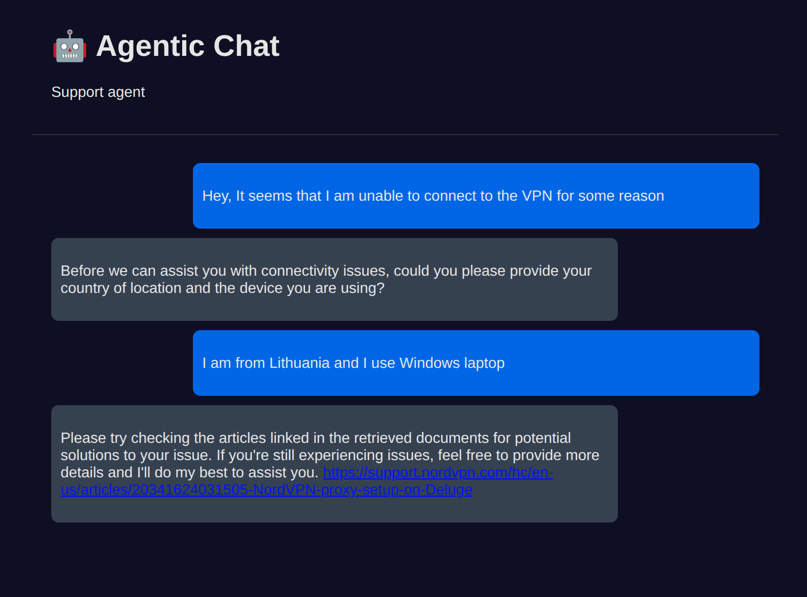

# AI Developer Homework Assignment: RAG Chatbot

## Setup Instructions

- Start Ollama: `ollama serve`
- Pull model: `ollama pull gemma3:4`
- (Optional) Create and activate a virtual environment:
  ```bash
  python3 -m venv .venv
  source venv/bin/activate  # On Windows use `venv\Scripts\activate`
  ```
- Install dependencies:
  ```bash
  pip install -r requirements.txt
  ```
- Start the chatbot UI:
  ```bash
  python web_ui.py
  ```
  Open your browser and navigate to <http://localhost:5000> to interact with the chatbot.

- To run ChainLit UI in the terminal:
  ```bash
  chainlit run chainlit_ui.py
  ```
  Open your browser and navigate to <http://localhost:8000> to interact with the chatbot.

---

## Python File Documentation

### chat_agent.py
Implements the main chatbot agent using smolagents' ToolCallingAgent and LiteLLMModel. Handles chat history, system prompts, and integrates RAG tool for retrieval-augmented generation.

### rag_tool.py
Defines the RetrieverTool for semantic search over documentation using LangChain, Chroma vector store, and HuggingFace embeddings. Includes logic for loading and splitting documents, and creating the vector store.

### web_ui.py
Flask-based web interface for the chatbot. Serves the HTML UI and exposes a /chat endpoint for AJAX chat requests, using the agent from chat_agent.py.

### chainlit_ui.py
ChainLit-based terminal UI for the chatbot. Handles incoming messages and routes them to the agent for responses.

## Functionality test

- 2 example conversations and answers from expected_answers.py file that we would like to get from the chatbot.

### Example Conversation 1


### Example Conversation 2


## Design Choices

- **smolagents**: I took a course about it and wanted to try it in some practical application
- **Ollama**: Easy to use. I have a GPU and I depleted my HuggingFace quota.
- **Gemma3**: I tried several models and this one gave the ok results.
